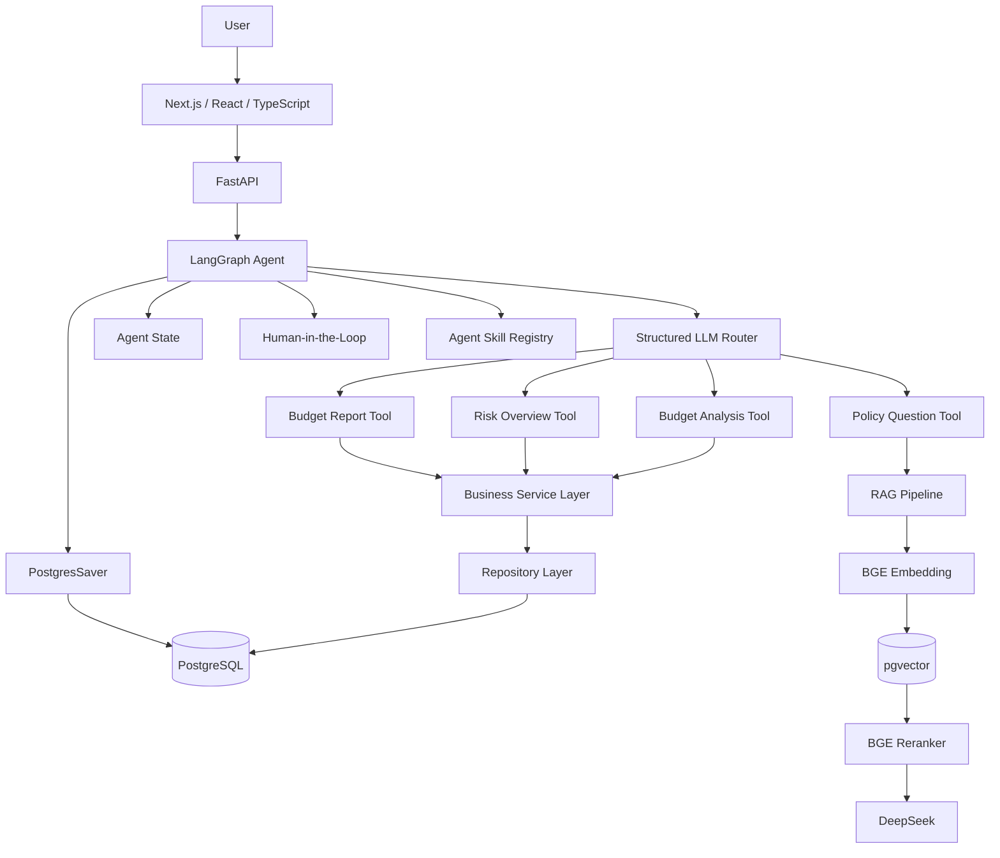

# BudgetPilot

> 企业预算与费用分析智能助手
> 基于 **FastAPI + LangGraph + PostgreSQL/pgvector + DeepSeek + Next.js** 构建的端到端 Agent 应用。

BudgetPilot 面向企业预算管理场景，将预算执行分析、费用风险检测、企业制度 RAG 问答、预算报告生成、多轮会话记忆以及 Human-in-the-Loop 审批整合到统一的 Agent 工作流中。

与直接调用大模型不同，BudgetPilot 将 LLM 限制在结构化意图识别与知识问答等适合模型处理的环节，实际预算计算、风险规则、数据库查询等业务能力通过受控 Tool、Service 和 Repository 执行，以提高系统的确定性、可测试性与可维护性。

---

## Demo

### 预算执行分析

用户可以直接使用自然语言查询部门预算执行情况：

```text
帮我看看研发部2026-07的预算执行情况
```

系统自动识别：

```text
department_id = D002
month = 2026-07
intent = budget_analysis
```

并通过结构化卡片展示：

* 总预算
* 实际支出
* 剩余预算
* 整体执行率
* 各费用类别执行情况
* 预算风险状态

> 建议在此处放置 BudgetSummaryCard 页面截图。

---

### 风险异常检测

在同一会话中继续输入：

```text
那风险呢？
```

Agent 可以通过 `thread_id + PostgresSaver` 恢复上一轮上下文，无需再次提供部门与月份。

风险分析包括：

* 接近预算上限
* 超预算
* 环比异常增长
* 大额费用异常
* 高 / 中 / 低风险汇总

> 建议在此处放置 RiskOverviewCard 页面截图。

---

### 企业制度 RAG 问答

例如：

```text
单笔费用达到50000元需要谁审批？
```

系统执行：

```text
问题
→ BGE Embedding
→ pgvector 检索
→ BGE Reranker
→ Top-K Context
→ DeepSeek
→ 带制度来源的回答
```

前端同时展示自然语言回答和制度来源卡片。

---

### Human-in-the-Loop

对于预算报告生成：

```text
帮我生成研发部2026-07的预算报告
```

Agent 不会立即执行，而是通过 LangGraph `interrupt()` 暂停工作流：

```text
budget_report
→ interrupt
→ waiting_for_approval
→ 用户批准 / 拒绝
→ Command(resume)
```

前端通过 ApprovalCard 提供：

```text
[拒绝]  [批准并生成]
```

只有用户批准后才真正执行预算报告生成 Tool。

---

### Agent Skill

BudgetPilot 实现了一个可复用的 Agent Skill：

```text
budget-risk-review
```

当用户请求：

```text
帮我全面审查研发部2026-07的预算风险
```

Router 会识别：

```text
intent = risk_overview
skill_name = budget-risk-review
```

随后按需加载完整 `SKILL.md`，并执行：

```text
预算执行分析
+
综合风险分析
```

最终由前端组合展示 BudgetSummaryCard 和 RiskOverviewCard。

---

# System Architecture



---

# Agent Workflow

BudgetPilot 使用单一 LangGraph Orchestrator，而不是为了展示概念而拆成多个 Agent。

当前支持五类意图：

```text
budget_analysis
risk_overview
policy_question
budget_report
unknown
```

核心流程：

```text
START
  ↓
normalize_input
  ↓
classify_intent
  ↓
┌────────────────────────────┐
│ budget_analysis            │
│ risk_overview              │
│ policy_question            │
│ budget_report              │
│ unknown                    │
└────────────────────────────┘
  ↓
Tool / RAG / HITL
  ↓
END
```

Router 使用 DeepSeek 进行结构化意图识别，并通过 Pydantic Schema 约束输出。

当 LLM Router 不可用时，系统还提供：

```text
keyword fallback
+
deterministic parameter extraction
```

例如中文部门名称：

```text
研发部 → D002
市场部 → D001
```

可以通过真实部门表进行确定性兜底，而不是完全依赖 LLM。

---

# Engineering Layers

BudgetPilot 将 Agent 与业务逻辑分层：

```text
Agent
↓
Tool
↓
Service
↓
Repository
↓
PostgreSQL
```

### Agent

负责：

* 意图识别
* 工作流编排
* State 管理
* Tool 调度
* Memory
* HITL
* Skill 激活

Agent 不直接写 SQL，也不直接实现预算业务规则。

### Tool

向 Agent 暴露受控业务能力，例如：

```text
budget_analysis_tool
risk_overview_tool
policy_question_tool
budget_report_tool
```

### Service

负责实际业务逻辑，例如：

* 预算执行计算
* 风险规则
* 环比异常
* 大额费用
* 风险汇总
* 报告生成

### Repository

负责数据库访问与聚合查询。

这种设计避免：

```text
LLM
→ 自由生成 SQL
→ 直接访问数据库
```

将模型能力限制在更可控的边界内。

---

# RAG Pipeline

BudgetPilot 的企业制度问答使用受控 RAG Pipeline：

```text
Markdown Policies
        ↓
Header Splitter
        ↓
Recursive Character Splitter
        ↓
BGE-small-zh-v1.5
        ↓
pgvector
        ↓
Top-6 Candidates
        ↓
BGE-reranker-base
        ↓
Top-2 Context
        ↓
DeepSeek
        ↓
Answer + Sources
```

当前知识库为模拟企业预算与费用管理制度，用于展示企业内部知识问答场景。

---

# RAG Evaluation

当前 RAG V1 使用冻结的小规模测试集进行基础评估。

### Retrieval

```text
Top-1 Accuracy: 0.8333
Recall@3:       1.0000
MRR:            0.9028
nDCG@3:         0.9276
```

Reranker 相比仅向量检索改善了 MRR 和 nDCG。

### Generation

确定性生成测试覆盖：

* 必需关键词
* 禁止内容
* 来源引用
* Citation
* 无答案拒答

当前测试集：

```text
6 / 6 passed
```

DeepEval 语义评估中：

```text
Faithfulness:      1.0
Answer Relevancy:  1.0
```

这些结果仅用于项目级实验验证，不代表生产环境准确率。

---

# Memory

BudgetPilot 使用 LangGraph Checkpointer 保存短期会话状态。

核心关系：

```text
State
= 保存什么信息

Checkpointer
= 如何保存 State

thread_id
= 当前属于哪个会话
```

当前使用：

```text
PostgresSaver
```

因此服务重启以后，已保存的 Agent 会话状态仍然可以恢复。

例如：

```text
用户：
帮我看看研发部2026-07的预算执行情况

Agent State：
department_id = D002
month = 2026-07
```

下一轮：

```text
用户：
那风险呢？
```

无需重新提供部门和月份。

---

# Human-in-the-Loop

预算报告生成使用 LangGraph：

```python
interrupt(...)
```

暂停 Agent 工作流。

前端收到：

```text
status = waiting_for_approval
requires_approval = true
```

用户批准：

```text
approved = true
```

然后：

```text
Command(resume=True)
```

恢复工作流并执行报告生成。

用户拒绝：

```text
Command(resume=False)
```

工作流结束，不执行报告 Tool。

---

# Agent Skill

当前实现：

```text
skills/
└── budget-risk-review/
    ├── SKILL.md
    └── references/
        └── risk_rules.md
```

Skill Registry 支持：

```text
list_skills()
load_skill_metadata()
load_skill()
```

采用 Progressive Disclosure：

```text
先读取：
name + description

Router 判断是否需要

需要时：
加载完整 SKILL.md
```

避免每次请求都将所有 Skill 内容塞入 Prompt。

---

# Tech Stack

### Backend

* Python 3.12
* FastAPI
* Pydantic
* LangGraph
* SQLAlchemy
* PostgreSQL
* pgvector
* psycopg
* Alembic

### LLM / RAG

* DeepSeek
* BGE-small-zh-v1.5
* BGE-reranker-base
* sentence-transformers
* DeepEval

### Frontend

* Next.js
* React
* TypeScript
* Tailwind CSS

### Engineering

* pytest
* GitHub Actions
* Alembic
* Structured Logging
* HITL
* PostgresSaver

---

# Project Structure

```text
BudgetPilot/
│
├── app/
│   ├── agent/
│   │   ├── workflow.py
│   │   ├── state.py
│   │   ├── tools.py
│   │   ├── router_service.py
│   │   ├── agent_service.py
│   │   ├── checkpointer.py
│   │   └── skill_registry.py
│   │
│   ├── rag/
│   │   ├── embedding_service.py
│   │   ├── vector_repository.py
│   │   ├── reranker_service.py
│   │   ├── retrieval_pipeline.py
│   │   └── rag_service.py
│   │
│   ├── main.py
│   ├── schemas.py
│   ├── models.py
│   ├── database.py
│   ├── budget_service.py
│   ├── risk_service.py
│   └── report_service.py
│
├── frontend/
│   ├── app/
│   ├── components/
│   └── lib/
│
├── knowledge/
│   └── policies/
│
├── skills/
│   └── budget-risk-review/
│
├── migrations/
├── scripts/
├── tests/
├── evaluation/
│
├── requirements.txt
├── requirements-dev.txt
└── README.md
```

---

# Quick Start

## 1. Clone

```bash
git clone <your-repository-url>
cd BudgetPilot
```

## 2. Python Environment

推荐 Python 3.12。

```bash
python -m venv .venv
```

激活环境后：

```bash
pip install -r requirements.txt
```

需要运行测试和 RAG 评估时：

```bash
pip install -r requirements-dev.txt
```

---

## 3. Environment Variables

复制：

```text
.env.example
```

为：

```text
.env
```

配置：

```env
DB_USER=
DB_PASSWORD=
DB_HOST=
DB_PORT=5432
DB_NAME=budgetpilot

DEEPSEEK_API_KEY=
```

不要将真实 `.env` 提交到 Git。

---

## 4. PostgreSQL

创建：

```text
budgetpilot
```

数据库，并确保安装 pgvector Extension。

初始化业务数据：

```bash
python -m scripts.seed_database
```

初始化制度向量：

```bash
python -m scripts.seed_policy_vectors
```

初始化 LangGraph checkpoint tables：

```bash
python -m scripts.setup_langgraph_checkpoints
```

---

## 5. Database Migration

项目使用 Alembic 管理业务 Schema。

```bash
alembic upgrade head
```

---

## 6. Start Backend

```bash
python -m uvicorn app.main:app --reload
```

默认：

```text
http://127.0.0.1:8000
```

Swagger：

```text
http://127.0.0.1:8000/docs
```

---

## 7. Start Frontend

```bash
cd frontend
npm install
npm run dev
```

默认：

```text
http://localhost:3000
```

前端环境配置参考：

```text
frontend/.env.example
```

---

# Tests

运行 Agent 核心回归测试：

```bash
python -m pytest tests/test_agent_workflow.py -q
```

当前：

```text
7 passed
```

项目还包含：

* Embedding tests
* Vector Repository tests
* Policy Loader tests
* Retrieval tests
* RAG Service tests
* API tests

---

# Continuous Integration

项目使用 GitHub Actions。

每次 Push / Pull Request 自动执行：

```text
Backend CI
→ PostgreSQL Service
→ Python Dependencies
→ LangGraph Checkpoint Setup
→ Agent Core Tests

Frontend CI
→ npm ci
→ ESLint
→ Next.js Production Build
```

当前 GitHub Actions：

```text
Backend Tests   ✅
Frontend Checks ✅
```

---

# Engineering Decisions

### Why LangGraph?

相比单纯使用大量 `if / else`：

LangGraph 可以显式管理：

* State
* Routing
* Conditional Edge
* Checkpoint
* Memory
* HITL
* Resume

更适合后续扩展复杂 Agent 工作流。

### Why structured routing?

LLM 只负责识别：

```text
intent
department_id
month
threshold
skill_name
```

并通过 Pydantic 约束输出。

实际 Tool 调用仍由确定性代码控制。

这样可以降低：

* 不可控 Tool 调用
* 参数幻觉
* 难以测试的问题

### Why PostgreSQL + pgvector?

预算数据和 Agent checkpoint 本身需要关系型数据库。

使用 PostgreSQL + pgvector 可以在同一个数据库体系中同时处理：

```text
结构化业务数据
+
向量检索
+
Agent checkpoint
```

### Why Reranker?

向量检索首先提高 Recall：

```text
Top-6
```

再通过 Cross-Encoder Reranker 提高最终 Context 排序质量：

```text
Top-2
```

### Why Human-in-the-Loop?

模型不应该默认拥有所有操作权限。

BudgetPilot 使用预算报告生成作为代表性 HITL 工作流：

```text
Agent提出操作
→ 人工确认
→ 才继续执行
```

真实企业场景中，同样的机制可以放在：

* 数据库写操作
* 审批提交
* 邮件发送
* 删除操作
* 财务确认

等高风险动作之前。

---

# Harness Engineering

BudgetPilot 不只是：

```text
Prompt + LLM
```

而是将模型放入完整的 Agent Harness 中：

```text
LLM
+
Pydantic Schema
+
Tools
+
State
+
Checkpointer
+
Memory
+
RAG
+
Skill
+
HITL
+
Logging
+
Tests
+
CI
```

目标是让模型在受控、可测试、可追踪的工程环境中运行，而不是让 LLM 自由决定所有行为。

---

# Current Limitations

当前项目定位为 Agent 开发实习作品集项目，而非生产级财务系统。

目前限制包括：

* 企业数据为模拟数据
* Policy Knowledge Base 规模较小
* RAG Evaluation Set 规模有限
* 当前 Router 仍依赖外部 LLM API
* 尚未接入企业身份认证与权限系统
* 尚未实现完整的长周期会话历史管理
* 尚未完成生产级 Docker 部署验证

---

# Future Work

后续可以进一步扩展：

* Hybrid Retrieval：BM25 / PostgreSQL FTS + Vector Search
* RRF Fusion
* 更大的冻结 Evaluation Set
* 独立 Judge Model
* Role-Based Access Control
* Agent Observability
* SSE / Streaming Agent UI
* Redis / Async Tasks
* Docker / Cloud Deployment
* 更多企业 Agent Skills

---

# Disclaimer

BudgetPilot 当前使用模拟企业预算、费用和制度数据，仅用于技术学习、Agent 工程实践和作品集展示，不用于真实企业财务决策。
