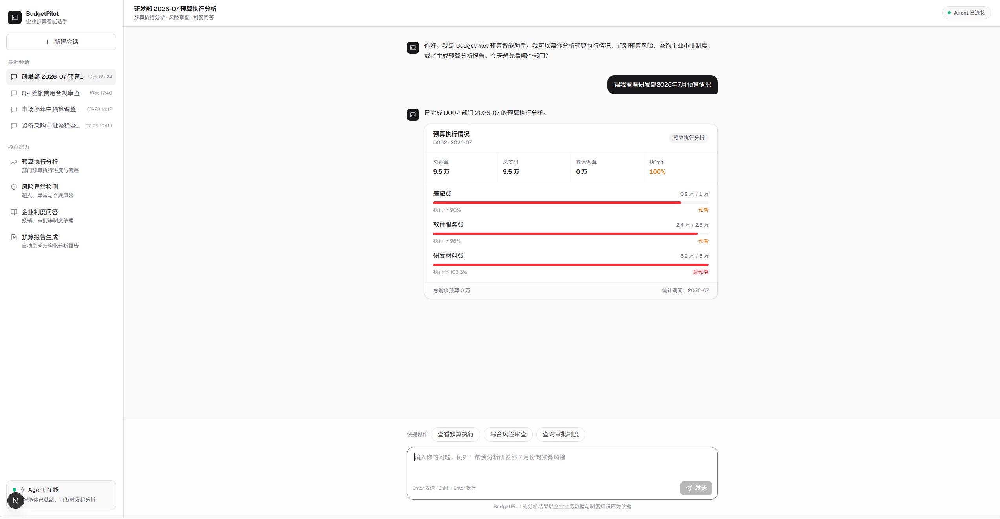
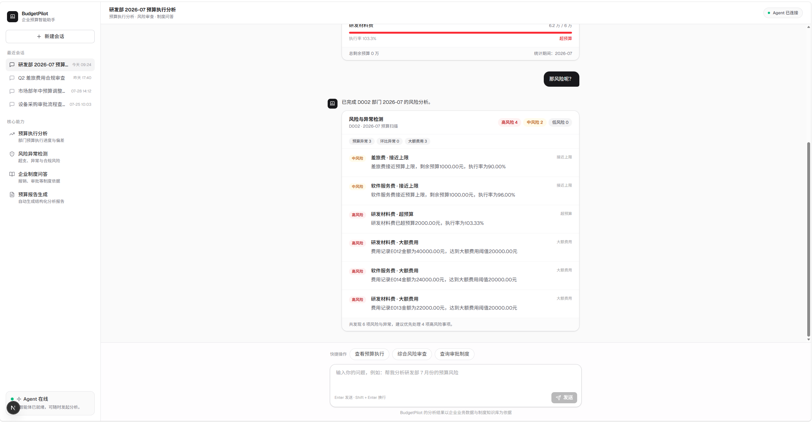
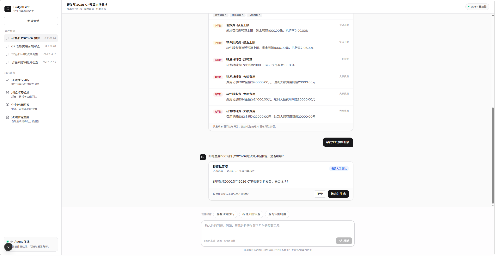

# 企业预算费用分析助手（Enterprise Budget Analysis Agent）

> 基于 **LangGraph + RAG + FastAPI + PostgreSQL + Next.js** 构建的企业级
> AI Agent
> 应用，实现自然语言驱动的预算分析、风险检测、制度问答和报告生成。

## 项目简介

BudgetPilot 是一个面向企业预算管理场景的 AI Agent 应用。

用户无需学习复杂系统操作，只需要通过自然语言描述需求，Agent 即可完成：

用户输入需求\
↓\
Agent 理解用户意图\
↓\
LangGraph 工作流编排\
↓\
Tool 调用业务能力\
↓\
数据库查询 / RAG 检索\
↓\
生成分析结果

系统支持预算查询、风险分析、企业制度问答以及报告生成。

------------------------------------------------------------------------

# Demo 展示

## 1. 自然语言预算查询

用户输入：

> 帮我看看研发部2026年7月预算情况

Agent 自动完成：

-   意图识别
-   参数提取（部门、月份）
-   调用预算分析 Tool
-   查询 PostgreSQL 业务数据
-   返回结构化分析结果



------------------------------------------------------------------------

## 2. 多轮对话风险分析

基于 LangGraph State 和 PostgresSaver 实现会话上下文保存。

用户继续输入：

> 那风险呢？

Agent 自动继承上一轮上下文：

``` text
department = 研发部
month = 2026-07
```

并调用风险分析 Tool。



------------------------------------------------------------------------

## 3. 智能交互界面

系统提供 Web 端交互页面，支持：

-   新建会话
-   历史会话查看
-   Agent 实时响应
-   分析结果展示



------------------------------------------------------------------------

# 核心功能

## 1. Agent Workflow

使用 LangGraph 构建可控 Agent 工作流：

-   Structured Router 意图识别
-   State 状态管理
-   Tool Calling
-   Checkpoint 持久化
-   Human-in-the-Loop 审批

支持任务：

-   budget_analysis
-   risk_overview
-   policy_question
-   budget_report

------------------------------------------------------------------------

## 2. Tool Calling 与业务系统集成

系统不允许 LLM 直接访问数据库，而采用：

``` text
Agent
 ↓
Tool
 ↓
Service
 ↓
Repository
 ↓
PostgreSQL
```

职责：

-   Agent：理解需求、选择路径、调度工具
-   Tool：提供预算查询、风险分析、报告生成能力
-   Service：负责业务计算和规则处理
-   Repository：负责数据访问

提升系统稳定性和可维护性。

------------------------------------------------------------------------

## 3. RAG 企业制度问答

构建企业制度文档 RAG Pipeline：

``` text
企业制度文档
 ↓
文本切分
 ↓
BGE Embedding
 ↓
pgvector 检索
 ↓
BGE Reranker 精排
 ↓
LLM生成答案
```

支持：

-   企业制度查询
-   来源引用
-   降低模型幻觉

------------------------------------------------------------------------

## 4. Memory 多轮会话

使用 LangGraph Checkpoint 机制保存 Agent 状态：

保存：

-   用户上下文
-   部门参数
-   月份信息
-   查询结果

实现连续问题分析。

------------------------------------------------------------------------

# 系统架构

``` text
Next.js
  ↓
FastAPI
  ↓
LangGraph Agent
  ↓
Router
  ↓
Tools
  ↓
Business Service
  ↓
PostgreSQL


RAG:

Document
  ↓
Embedding
  ↓
pgvector
  ↓
Reranker
  ↓
LLM
```

------------------------------------------------------------------------

# 技术栈

## Agent / LLM

-   LangGraph
-   DeepSeek API
-   Tool Calling
-   Structured Output
-   Human-in-the-Loop

## RAG

-   BGE Embedding
-   pgvector
-   BGE Reranker

## Backend

-   Python
-   FastAPI
-   PostgreSQL
-   SQLAlchemy
-   Alembic

## Frontend

-   Next.js
-   React
-   TypeScript

## Engineering

-   pytest
-   GitHub Actions
-   Docker

------------------------------------------------------------------------

# 项目结构

``` text
BudgetPilot/

├── agent/
├── tools/
├── services/
├── repository/
├── rag/
├── frontend/
├── tests/
├── evaluation/
└── README.md
```

------------------------------------------------------------------------

# Engineering Highlights

## 为什么使用 LangGraph？

相比传统 if-else 工作流，LangGraph 提供：

-   显式状态管理
-   条件路由
-   Checkpoint 恢复
-   人工审批
-   可扩展工作流

## 为什么 Tool 不直接让 LLM 操作数据库？

预算系统需要保证：

-   数据准确性
-   业务规则稳定
-   可测试性

因此：

LLM 负责理解和生成，确定性业务逻辑交给代码执行。

------------------------------------------------------------------------

# Future Work

-   Hybrid Retrieval
-   权限控制
-   Agent Observability
-   Docker 部署
-   更多企业 Agent Skill

------------------------------------------------------------------------

# Disclaimer

本项目使用模拟企业预算、费用和制度数据，仅用于 Agent
工程实践和作品集展示。
